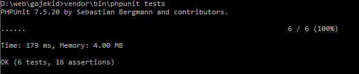

## <center>Un-Official Gojek API Wrapper</center>
Repository Berikut Ini Merupakan Porting Dari [GOJEK](https://github.com/ridwanfathin/gojek) Untuk PHP

<b>[Fitur Akun Pengguna GOJEK](#fitur-akun-pengguna-gojek)</b>
- [x] Login Dengan Nomor Handphone Untuk Mendapatkan `loginToken`
- [x] Login Dengan Email Untuk Mendapatkan `loginToken`
- [x] Login Dengan OTP Untuk Mendapatkan `authToken`
- [x] Menampilkan Informasi Akun Pengguna
- [x] Melakukan Perubahan Pada Akun
- [ ] Melakukan Verifikasi Perubahan Pada Akun
- [x] Menampilkan Jumlah Saldo
- [x] Logout

<b>[Fitur Akun Pengguna GOPAY](#fitur-akun-pengguna-gopay)</b>
- [x] Menampilkan Detail Data Informasi
- [x] Menampilkan History Transaksi
- [x] Mengambil Data Wallet Code `QrId` Untuk Method Transfer
- [x] Transfer Ke Sesama GOPAY

<b>[Fitur Data Booking GOJEK](#fitur-data-booking-gojek)</b>
- [x] Menampilkan Booking History
- [x] Menampilkan Booking Yang Masih Aktif
- [ ] Mengambil Data Booking Berdasarkan `orderNo`
- [ ] Mengkalkulasi Pemakaian GOPAY Pada GOJEK

<b>[Fitur Data GOFOOD](#fitur-data-gofood)</b>
- [x] Menampilkan Data GOFOOD Bedasarkan Lokasi `latLong`
- [x] Menampilkan Data GOFOOD Terdekat Berdasarkan Lokasi `latLong` Dan `limit`
- [ ] Menampilkan Data Restaurant Bedasarkan `restaurantId`
- [x] Menampilkan Data Restaurant Bedasarkan `category`

<b>[Fitur Data GOPOINTS](#fitur-data-gopoints)</b>
- [x] Menampilkan Jumlah Point
- [x] Menampilkan Point Lanjutan
- [x] Menebus Point

<b>[Fitur Data Area GORIDE GOCAR GOSEND GOMART](#fitur-data-area-goride-gocar-gosend-gomart)</b>
- [x] Menampilkan Data Area Berdasarkan Lokasi `latLong`
- [x] Menampilkan Data Area Driver Terdekat GORIDE Berdasarkan Lokasi `latLong`
- [x] Menampilkan Data Area Driver Terdekat GOCAR Berdasarkan Lokasi `latLong`
- [x] Menampilkan Data Area Driver Terdekat GOSEND Berdasarkan Lokasi `latLong`
- [ ] Menampilkan Data Area GOMART Terdekat Berdasarkan Lokasi `latLong`

### Dokumentasi

#### Langkah Untuk Menjalankan GojekID
##### Ambil Paket Pada Composer
```php
composer require maulana20/gojekid
```
##### Jika Di Jalankan Dengan Laravel Tinker

[](./../../)

##### Jika Di Jalankan Dengan Native
```php
require 'vendor/autoload.php';
use Maulana20\GojekID;

$gojek = new GojekID();
```

#### Fitur Akun Pengguna GOJEK
##### Login Dengan Nomor Handphone
```php
$loginToken = $gojek->loginPhone('<mobilePhone>')->getLoginToken();
```
##### Login Dengan Email
```php
$loginToken = $gojek->loginEmail('<Email>')->getLoginToken();
```
##### Login Pada GOJEK
```php
$authToken = $gojek->loginGojek('<loginToken>', '<OTP>')->getAuthToken();
```
##### Menampilkan Informasi Akun Pengguna
```php
$gojek->setAuthToken('<authToken>');
$result = $gojek->getCustomer()->getResult();
```
##### Melakukan Perubahan Pada Akun
```php
$gojek->setAuthToken('<authToken>');
$result = $gojek->editAccount('<mobilePhone>', '<email>', '<name>')->getResult();
```
##### Melakukan Verifikasi Perubahan Pada Akun
```php
$gojek->setAuthToken('<authToken>');
$result = $gojek->editAccountVerify('<id>', '<mobilePhone>', '<verificationCode>')->getResult();
```
##### Menampilkan Jumlah Saldo
```php
$gojek->setAuthToken('<authToken>');
$balance = $gojek->checkBalance()->getBalance();
```
##### Logout
```php
$gojek->setAuthToken('<authToken>');
$gojek->logout();
```

#### Fitur Akun Pengguna GOPAY
##### Menampilkan Detail Data Informasi
```php
$gojek->setAuthToken('<authToken>');
$result = $gojek->gopayDetail()->getResult();
```
##### Menampilkan History Transaksi
```php
$gojek->setAuthToken('<authToken>');
$result = $gojek->gopayHistory('<page>', '<limit>')->getResult();
```
##### Mengambil Data Wallet Code
```php
$gojek->setAuthToken('<authToken>');
$QrId = $gojek->checkWalletCode('<mobilePhoneTo>')->getQrId();
```
##### Transfer Ke Sesama GOPAY
```php
$gojek->setAuthToken('<authToken>');
$ref = $gojek->gopayTransfer('<QrId>', '<PIN>', '<amount>', '<description>')->getRef();
```

#### Fitur Data Booking GOJEK
##### Menampilkan Booking History
```php
$gojek->setAuthToken('<authToken>');
$result = $gojek->gojekHistory('<userId>')->getResult();
```
##### Menampilkan Booking Yang Masih Aktif
```php
$gojek->setAuthToken('<authToken>');
$result = $gojek->gojekActive()->getResult();
```
##### Mengambil Data Booking Berdasarkan Nomor Pesanan
```php
$gojek->setAuthToken('<authToken>');
$result = $gojek->gojekByOrder('<orderNo>')->getResult();
```
##### Mengkalkulasi Pemakaian GOPAY Pada GOJEK
```php
$gojek->setAuthToken('<authToken>');
$result = $gojek->gojekCalculate()->getResult();
```

#### Fitur Data GOFOOD
##### Menampilkan Data GOFOOD Bedasarkan Lokasi
```php
$gojek->setAuthToken('<authToken>');
$result = $gojek->gofoodHome('<latLong>')->getResult();
```
##### Menampilkan Data GOFOOD Terdekat Berdasarkan Lokasi Dan Batas Jumlah
```php
$gojek->setAuthToken('<authToken>');
$result = $gojek->gofoodNearby('<latLong>', '<page>', '<limit>')->getResult();
```
##### Menampilkan Data Restaurant Bedasarkan restaurantId
```php
$gojek->setAuthToken('<authToken>');
$result = $gojek->gofoodRestaurantById('<restaurantId>')->getResult();
```
##### Menampilkan Data Restaurant Bedasarkan Category
```php
$gojek->setAuthToken('<authToken>');
$result = $gojek->gofoodRestaurantByCategory('<category>', '<page>', '<limit>')->getResult();
```

#### Fitur Data GOPOINTS
##### Menampilkan Jumlah Point
```php
$gojek->setAuthToken('<authToken>');
$result = $gojek->gopointBalance()->getResult();
```
##### Menampilkan Point Lanjutan
```php
$gojek->setAuthToken('<authToken>');
$result = $gojek->gopointNext()->getResult();
```
##### Menebus Point
```php
$gojek->setAuthToken('<authToken>');
$result = $gojek->gopointReedem('<goPointsToken>')->getResult();
```
#### Fitur Data Area GORIDE GOCAR GOSEND GOMART
##### Menampilkan Data Area Berdasarkan Lokasi
```php
$gojek->setAuthToken('<authToken>');
$result = $gojek->areaLocation('<latLong>')->getResult();
```
##### Menampilkan Data Area Driver Terdekat GORIDE Berdasarkan Lokasi
```php
$gojek->setAuthToken('<authToken>');
$result = $gojek->gorideNearby('<latLong>')->getResult();
```
##### Menampilkan Data Area Driver Terdekat GOCAR Berdasarkan Lokasi
```php
$gojek->setAuthToken('<authToken>');
$result = $gojek->gocarNearby('<latLong>')->getResult();
```
##### Menampilkan Data Area Driver Terdekat GOSEND Berdasarkan Lokasi
```php
$gojek->setAuthToken('<authToken>');
$result = $gojek->gosendNearby('<latLong>')->getResult();
```
##### Menampilkan Data Area GOMART Terdekat Berdasarkan Lokasi
```php
$gojek->setAuthToken('<authToken>');
$result = $gojek->gomartNearby('<latLong>')->getResult();
```

### Melakukan Testing Pada PHP Unit Tests

[](./../../)

### Author

[Maulana Saputra](mailto:maulanasaputra11091082@gmail.com)
